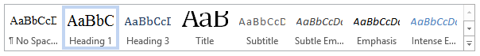
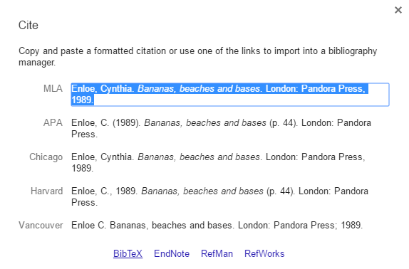

#A brief introduction to Intermediate RMarkdown.

`RMarkdown` is an incredibly poweful platform for developing interactive or static documents that include stylistic elements, but also include elements of analytic code.

RMarkdown effectively pipes a `markdown` document through an R Console, merges the output and then processes it using `pandoc`.  Just as with the R ecosystem itself, as you begin to bring in external packages there is an enormous breadth to the kinds of products you can generate with RMarkdown (see the [RStudio template gallery](http://rmarkdown.rstudio.com/gallery.html)).  From standalone documents, to books, webpages and more, RMarkdown can be an important tool for generating reproducible research in the R environment.

## Getting Started

The first thing to do is to create a new document.  You can edit RMardown files using any kind of editor, as long as the file ends up as a text-based file.  The function that renders RMarkdown into a particular output type is `render` in the `rmarkdown` package, so you can run it from an R console, or from the commandline as:

```bash
Rscript -e "rmarkdown::render('Goring_RmarkdownTutorial.Rmd')"
```

Let's take a look at the `Rmd` file and the output.  I've tried to make this part of the commit history of the GitHub project.  We'll see how well this holds up :)

* [Original `Rmd` file](https://github.com/SimonGoring/LearningToRMarkdown/blob/6d1968dcd4e49c1a2e884813b4c1b9ad5e62a005/Goring_RMarkdownTutorial.Rmd)
* [Original `html` output](http://htmlpreview.github.io/?https://github.com/SimonGoring/LearningToRMarkdown/blob/6d1968dcd4e49c1a2e884813b4c1b9ad5e62a005/Goring_RMarkdownTutorial.html)

So this gives us a good start, but it's only a start.  Your next step is probably to remove all the content and start over.  That was my next step, replacing the content of the RMarkdown template, and replacing it with content up to the end of this introduction.  I'm going to commit it as well and render, so you can see how the HTML and Rmd files change.

## The YAML Header

The first thing you might notice when you look at your new RMarkdown document is a curious set of code separated by a set of dashes.  It looks something like this:

```yaml
---
title: "Learning to RMarkdown"
author: "Simon Goring"
date: "October 30, 2016"
output: html_document
---
```

This is YAML.  YAML is a way of conveying structured information that was developed to be human readable.  While YAML originally meant "*Yet Another Markup Language*", the original authors were computer scientists and so prefered the recursive "*YAML Ain't Markup Language*".  The reason for this is that YAML is not a markup language, it is a way of conveying structured data.  Because YAML uses no braces, only tabs and carriage returns, it is easier for a person to understand.  However, its apparent stylistic simplicity is not limiting.  YAML can pass very complex data structures.

For RMarkdown documents we don't generally need a lot of complexity.  Our first set of edits rendered something that produces [a fairly passable HTML page](http://htmlpreview.github.io/?https://github.com/SimonGoring/LearningToRMarkdown/blob/b88f2cf7bf99612a90ab56769f63396190513108/Goring_RMarkdownTutorial.html).

You can see how the various elements are rendered to HTML.  The key pair `title: "Learning to RMarkdown"` (note that you must always use a space after the colon) is converted to text with the `<title>` tag in HTML.  There is a wack of CSS code, and some `<meta>` tags are declared for document metadata.

There's a surprising amount of extra code in RMarkdown documents.  The raw file at this stage is 600KB of code, which is big for so little (valuable) content.  This is a function of how the `html_document` is generated.  We can change the attributes of the document by modifiying the YAML.  In particular we could use the flag `self_contained: false` to split out the raw HTML and all included files & scripts.  What happens when you use that?  How big is your file now?

### Nested Lists in YAML

Lets play with different themes.  You can [download this document](https://raw.githubusercontent.com/SimonGoring/LearningToRMarkdown/9e7eecb541e95787aece7ffd62baf840370d2aba/Goring_RMarkdownTutorial.Rmd) and modify the theme by changing the key-pair `output: html_document` to a YAML-type list:

```yaml
---
title: "Learning to RMarkdown"
author: "Simon Goring"
date: "October 30, 2016"
output:
  html_document:
    theme: "lumen"
---
```

By indenting the carriage returns we've created a list.  RMarkdown supports multiple output types.  [My ESA2016 presentation](http://htmlpreview.github.io/?https://github.com/SimonGoring/Hacking_Disciplines-ESA2016_IGN5-4/blob/master/Goring_HackingDisciplines.html) in Mozilla Science R Study Group alumni Andrew MacDonald's Ignite session was generated using `revealjs::revealjs_presentation` as the output type, along with its associated output options.

There are more themes available, along with code highlighting on the [RStudio RMarkdown html_document page](http://rmarkdown.rstudio.com/html_document_format.html#appearance_and_style).

## Chunk Elements

As you continue developing your content you can add in code blocks, source external code, add tables and figures, as we've seen before.

For this section I will read in some content, create a table from the head of the content, and show you how to generate captions.  I'll also add some code options.  One great thing about using the `captioner` package is that is was developed by [Althea Letaw](https://github.com/adletaw), a UBC researcher in the Zoology Department.

```{r, results = "hide", message = FALSE}
library(captioner, quietly = TRUE, verbose = FALSE)

# Initialize our caption types:
figs <- captioner(prefix = "Figure")
tabs <- captioner(prefix = "Table")

library(analogue, quietly = TRUE, verbose = FALSE)
data(abernethy)

figs(name = "bet_pol", "Plot of *Betula* pollen against time from Abernethy Forest in Scotland.")

plot(Betula ~ Age, data = abernethy, type = "b")

```

`r figs("bet_pol")`

This now gives us a figure and a citation for `r figs("bet_pol", display = "cite")`, using the `captioner` package.  There are likely other ways to build the citation, but this works well for me.  The one issue is that there are cases where you may want to generate and reference citations out of order because of coding flow choices.  It may result in unexpected behaviour.

You can change the plotting size in your document by adding `fig_width` and `fig_height` options to the code chunk, but you can also edit your YAML header if you want to maintain consistent heights.

```{r, results = "hide", message = FALSE}
figs(name = "gram_pol", "Plot of Gramineae pollen against time from Abernethy Forest in Scotland.")

plot(Gramineae ~ Age, data = abernethy, type = "b")

```

`r figs("gram_pol")`

Take some time to [download this version](https://github.com/SimonGoring/LearningToRMarkdown/blob/cfbac5f5ec541fbfc8dbff1bc1d9b3c811f38200/Goring_RMarkdownTutorial.Rmd) of the repository and edit the chunks and the YAML header.  Make the figures equal sizes, make then different sizes, try both.  Which over-rides which?

## Styling Your Web Pages

I've now added some elements to the header so my figures are plotted uniformly, what about tables?  There are several ways to print out tables, using raw R, `knitr`'s `kable()` function, or you can use paged HTML tables by modifying the header.

Try these options out on [this version of the document](https://github.com/SimonGoring/LearningToRMarkdown/blob/2437ae4a54181bd8c35eb7f91be6e093213094e3/Goring_RMarkdownTutorial.Rmd), using the following code element:

```{r, results = "hide", echo = FALSE, message = FALSE}
tabs("abe_pln", "Plain table using RMarkdown.")
tabs("abe_knt", "kable table using RMarkdown.")
```

`r tabs("abe_pln")`

```{r, results = "as-is", echo = FALSE, message = FALSE}
(head(abernethy[,1:5]))
```

`r tabs("abe_knt")`

```{r, results = "as-is", echo = FALSE, message = FALSE}
knitr::kable(head(abernethy[,1:5]))
```

You can see how these different versions change how your data appears.  `kable()` has a lot of different options to change the model styling.  There are other ways of making pretty tables in RMarkdown, including generating them by hand.  I would generally suggest automating it as much as possible though.

You can also embed HTML code chunks, scripts, paragraph styling and others.  For example, you could push references with hanging indents that look like this:

<p class="hangingindent">Goring S, Dawson A, Williams JW, Simpson G, Grimm EC, Dawson R. 2015. neotoma: A programmatic interface to the Neotoma Paleoecological database.<i>Open Quaternary</i> <b>1</b>:2. [<a href="http://www.openquaternary.com/article/10.5334/oq.ab/">Open Access</a>]</p>

By using the HTML:

```html

<p class="hangingindent">Goring S, Dawson A, Williams JW, Simpson G, Grimm EC, Dawson R. 2015. neotoma: A programmatic interface to the Neotoma Paleoecological database.<i>Open Quaternary</i> <b>1</b>:2. [<a href="http://www.openquaternary.com/article/10.5334/oq.ab/">Open Access</a>]</p>
```

This requires the addition of a CSS file, which you can [see in this commit](https://github.com/SimonGoring/LearningToRMarkdown/tree/a1acbad36901714271958ed42784eb7bb921e613/css).  CSS is a common feature of modern webages.  It stands for "Cascading Style Sheet" and you can read more about it on the [Wikipedia page for CSS](https://en.wikipedia.org/wiki/Cascading_Style_Sheets).  It's possible to copy and paste, or otherwise write your own styles for particular elements of the sheet.  When you do this you can provide a richer HTML document than the defaults allow.  

If you want to include some sort of header bar, or footer bar, for example, if you want all your pages to have a similar feel you can use the YAML tags:

```html
    includes:
      before_body: header.html
      after_body: footer.html
```

This will add stand-alone HTML documents before and after the rendered document.  If you're generating a lot of reports, as I have been doing for these [Neotoma dataset landing pages](http://htmlpreview.github.io/?https://github.com/NeotomaDB/neotomadb.github.io/blob/master/dataset/1050/index.html) it helps keep your markdown document clean by allowing you to directly [link from another file](http://htmlpreview.github.io/?https://github.com/NeotomaDB/AssignDOIs/blob/master/builder/header.html).

That said, it also makes things more complicated.  So lets try to make things easy, using Word.

## Styling your Word Documents

Many of us are more comfortable using Word, and, if you're in a large collaboration, your collaborators might also be using Word for editing and revising.  You may also be interested in using Word to write your thesis.

Word uses a lot of different markup styles:



You might notice that the ones in the image are different than the default styles.  It's because I hate cerulian, so I edited my Word styles and save the document.

<blockquote class="twitter-tweet" data-lang="en"><p lang="en" dir="ltr">To me cerulean will always be <a href="https://twitter.com/hashtag/003FFF?src=hash">#003FFF</a>. New question, how many hex triplets are also twitter hash tags? :)</p>&mdash; Simon Goring (@sjGoring) <a href="https://twitter.com/sjGoring/status/793198250266234881">October 31, 2016</a></blockquote>
<script async src="http://platform.twitter.com/widgets.js" charset="utf-8"></script>

The nice thing about RMarkdown is that you can use an existing word document as a template.  Under your `output` block in the YAML header you can add:

```yaml
  word_document:
    reference_docx: word_template.docx
```
This word template was added as part of a commit that also included the following, very creepy (and totally real) Halloween image:


So now, if we download the appropriate files, modify the YAML and render the document, we should get a new Word file.  Give it a shot.

## Adding a Bibliography

RMarkdown works with Bibtex type bibliographic files.  It's possible to get bibtex from things like Google Scholar directly, or export them from your reference manager.



To add in references to your Markdown file you need to do three things:

1.  Create a bibtex file for your references & cite it in your YAML header using `bibliography: file_name.bib`
2.  Choose an appropriate style using one of many `csl` files.  [The Citation Style Language GitHub repository](https://github.com/citation-style-language/styles) has over a thousand styles to choose from.  Copy it to your project directory and add: `csl: elsevier-harvard.csl` to your YAML header.
3. Cite the references using the format `[@referenceOne;@referenceTwo]`, or `[-@ReferenceThree]` if you want to exclude the citation year.

Easy peasy!

I have now run out of time :)